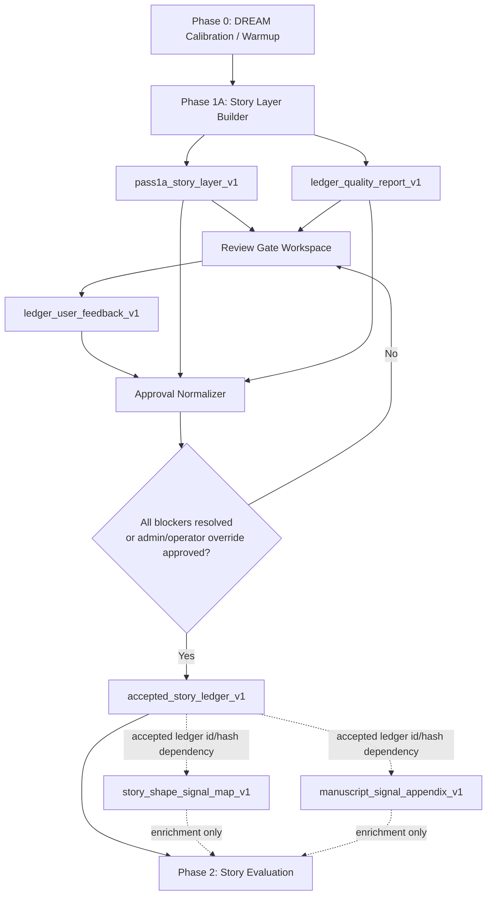
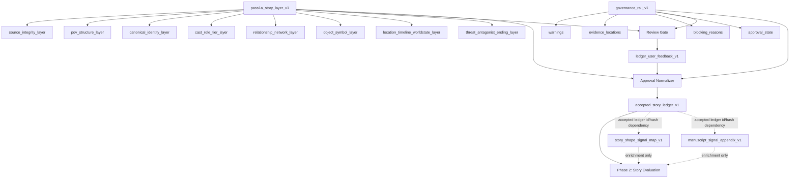

# STORY_LAYER_CONTRACT_V1

## Canonical doctrine

The canonical flow is:

```text
Phase 0 → Phase 1A → Review Gate → Approval Normalizer → Phase 2
```

Phase 2 may consume `accepted_story_ledger_v1` as its only story-understanding authority. It may also consume `dream_calibration_packet_v1`, `manuscript_evidence_map`, and non-governing support artifacts.

`pass1a_story_layer_v1` contains exactly eight story layers and nothing else. Governance remains separate. Support artifacts remain separate. There is no Layer 9.

## Artifact flow



## Gate rule

Every path must pass through the Review Gate and write `ledger_user_feedback_v1`, even when there are no hard fails and the disposition is `accepted_without_changes`.

The Approval Normalizer must never create `accepted_story_ledger_v1` from `pass1a_story_layer_v1` alone.

`accepted_with_override` may only be written by `admin` or `operator` roles and must preserve unresolved warnings in governance.

## No Layer 9 model



## Runtime envelope

Use the repo-aligned runtime envelope below for artifact content. `evaluation_project_id` should be the public artifact field name because the existing bridge vocabulary already uses that field on the legacy job path. `stage_run_id` is optional for artifacts written inside the staged runner.

```ts
export type RuntimeArtifactEnvelope = {
  job_id: string;
  evaluation_project_id: string | null;
  stage_run_id?: string | null;
  manuscript_id: number;
  manuscript_version_hash: string;

  artifact_id: string;
  artifact_type: string;
  artifact_version: string;
  source_hash: string;
  generated_at: string;
};
```

## Supporting signal artifacts

`story_shape_signal_map_v1` and `manuscript_signal_appendix_v1` enrich Phase 2 but do not alter, override, or replace `accepted_story_ledger_v1`. They are not Story Layer layers and do not create Layer 9.

They must reference `accepted_story_ledger_v1.artifact_id` and `accepted_story_ledger_v1.source_hash`. If the accepted ledger changes, those support artifacts are stale and must be regenerated or marked degraded before use.

## Implementation order

1. PR 1: docs only — split and freeze contract authorities.
2. PR 2: artifact registry + schemas.
3. PR 3: stage machine / hard-stop contract.
4. PR 4: Phase 1A writes `pass1a_story_layer_v1` + `ledger_quality_report_v1`.
5. PR 5: approval writes `accepted_story_ledger_v1`.
6. PR 6: support artifacts — `story_shape_signal_map_v1` + `manuscript_signal_appendix_v1`.
7. PR 7: UI shell.

Do not move runtime code yet. Do not build UI yet. The UI shell must reflect this contract and must not introduce alternate approval paths.
